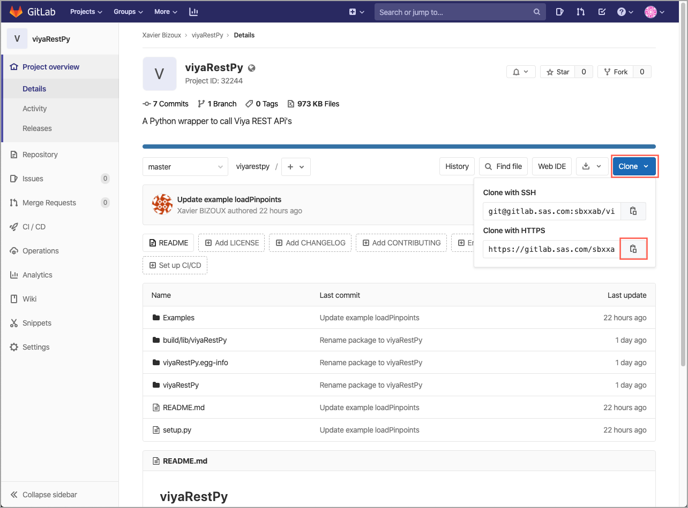
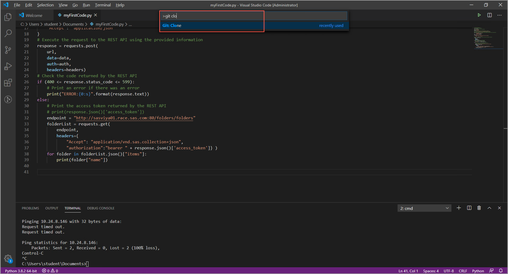
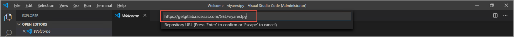
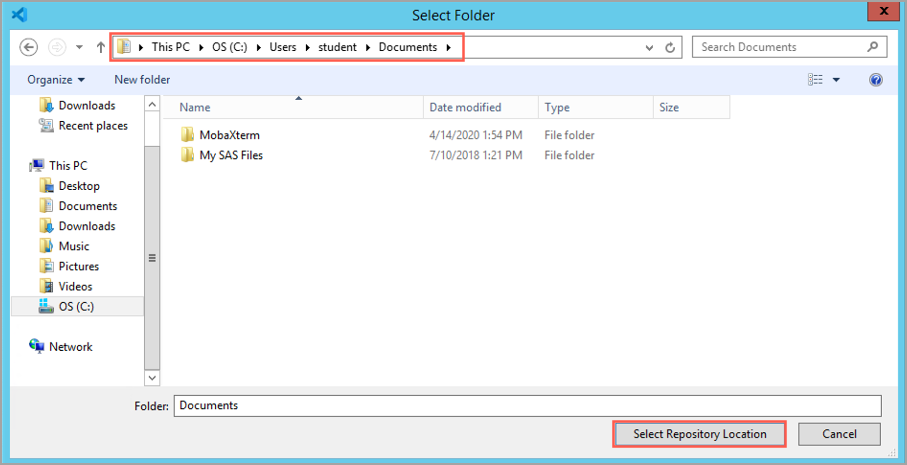
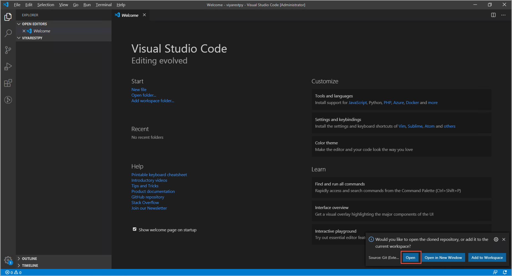
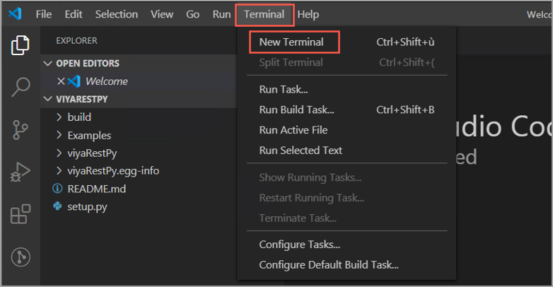
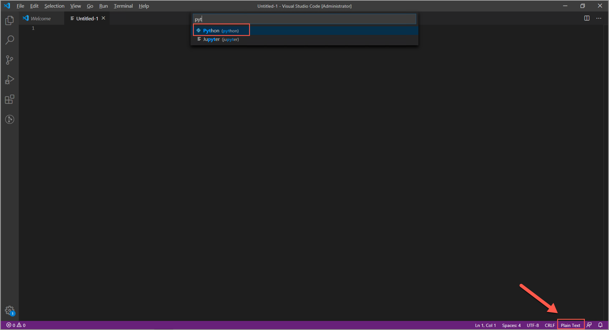

# viyaRestPy

- [Introduction](#introduction)
  - [The package content](#the-package-content)
  - [The usage](#the-usage)
  - [The installation](#the-installation)
  - [Writing your first code](#writing-your-first-code)
  - [Take away](#take-away)

## Introduction

I've been writing some Python code to access the SAS Viya REST API's. In this process, I've been writing multiple functions and reused those functions to avoid typing the same code again and again across different projects.
I thought it would be good if others could benefit from what I wrote to ease their REST API usage from Python. This is where this project started.
The main idea is to have a wrapper function that can generic enough to call nearly all the existing SAS Viya REST API's and still handle the authentication process and reduce the time to write other functions dedicated for more specific tasks.

### The package content

The project contains the package in folder *viyaRestPy* and examples in the *Examples* folder. The *setup.py* is there to help install the package while still in development. The other folders contain information that relates to the build of the package.

### The usage

The foundation of the viyaRestPy package is the callRest function. That function calls the SAS Viya REST API's and takes care of the wiring needed to authenticate the user and call the needed endpoint. The callRest function returns a response in the form of JSON object containing: headers and json objects.

```json
{
    "headers": {},
    "json": {}
}
```

For authentication, the callRest function uses an authentication information object. This object contains the following information:

```json
{
    "user": "username",
    "pw": "password",
    "serverName": "urlToViya:port",
    "appName": "applicationName",
    "appSecret": "applicationSecret"
}
```

In this authentication information object, the application name and the application secret are the ones that have been defined when configuring SAS Viya for REST API access.
If for some reasons, the authentication information are not filled in or are incomplete, the authentication mechanism will try to use the authentication information that might have been generated by the sas-admin CLI.

The package contains what we can call "Lego" functions that can be used for specific tasks like:

- Extracting a report based on the report name and the folder location
- Deleting a report based on the report name and the folder location
- Updating report content
- ...

Those "Lego" functions are in fact calling multiple times the callRest function for different endpoints and passing information between the different calls.
As this is a work in progress, the number of "Lego" functions is small but is expanding.

The principle is that all the "Lego" functions as the callRest function are returning the same simple object containing a header and a JSON object. Tasks like displaying results or writing information to a file should be left outside of the package. The examples are demonstrating how to read parameters from the command line and how to write output files or use input files to pass information to "Lego" functions or the callRest function.

### The installation

As the package is not published (yet) to a Python repository, here are the steps to install the package on your environment:

1. Open the project on <https://gitlab.sas.com/GEL/viyarestpy>
1. Click on **Clone** and then on the **Copy** icon.

   

1. Within Visual Studio Code, open the **Command palette** by pressing CTRL+SHIFT+P or under **View** menu, select **Command Palette...**.
1. In the **Command Palette**, type: *git clone* and select *Git: Clone*

    

1. When prompted for the *Repository URL*, paste the URL you copied from GitLab.

    

1. When asked to *Select Folder*, select the location where you want to store the code and press the **Select Repository Location**.

    

1. When the repository is cloned to your machine, you will be asked if you want to open the cloned repository. Click on **Open**.

    

1. You have now cloned the repository and you can access it from Visual Studio Code. The next step is to build the package in order to use it for your developments. You should therefore click on **Terminal** and select **New Terminal**.

    

1. In the Terminal, execute the following command:

    ```bash
    py -3 setup.py develop
    ```

    This command will build the package in development mode and display the following information in the Terminal (if you are running on Windows):

    ```bash
    py -3 setup.py develop
    running develop
    running egg_info
    writing viyaRestPy.egg-info\PKG-INFO
    writing dependency_links to viyaRestPy.egg-info\dependency_links.txt
    writing requirements to viyaRestPy.egg-info\requires.txt
    writing top-level names to viyaRestPy.egg-info\top_level.txt
    reading manifest file 'viyaRestPy.egg-info\SOURCES.txt'
    writing manifest file 'viyaRestPy.egg-info\SOURCES.txt'
    running build_ext
    Creating c:\python38\lib\site-packages\viyaRestPy.egg-link (link to .)
    viyaRestPy 0.1 is already the active version in easy-install.pth

    Installed c:\users\student\documents\viyarestpy
    Processing dependencies for viyaRestPy==0.1
    Searching for requests==2.23.0
    Best match: requests 2.23.0
    Adding requests 2.23.0 to easy-install.pth file

    Using c:\python38\lib\site-packages
    Searching for certifi==2020.4.5.1
    Best match: certifi 2020.4.5.1
    Adding certifi 2020.4.5.1 to easy-install.pth file

    Using c:\python38\lib\site-packages
    Searching for urllib3==1.25.8
    Best match: urllib3 1.25.8
    Adding urllib3 1.25.8 to easy-install.pth file

    Using c:\python38\lib\site-packages
    Searching for idna==2.9
    Best match: idna 2.9
    Adding idna 2.9 to easy-install.pth file

    Using c:\python38\lib\site-packages
    Searching for chardet==3.0.4
    Best match: chardet 3.0.4
    Adding chardet 3.0.4 to easy-install.pth file
    Installing chardetect-script.py script to C:\Python38\Scripts
    Installing chardetect.exe script to C:\Python38\Scripts

    Using c:\python38\lib\site-packages
    Finished processing dependencies for viyaRestPy==0.1
    ```

1. You are now ready to use the package and write your own code!

### Writing your first code

As mentioned earlier the viyaRestPy package is developed to ease calls to SAS Viya REST API's. In this section, you will write a code to extract some folder's information.

1. In Visual Studio Code, create a new file. Click on the **File** menu and select **New File**.
1. Change the language of the new file to Python.

    

1. In the file type the following code:

    ```python
    # Import module(s)
    from viyaRestPy.Folders import getFolder

    # Collect information needed for authentication
    authInfo = {}
    authInfo["user"] = "gatedemo003"
    authInfo['pw'] = "lnxsas"
    authInfo["serverName"] = "http://sasviya01.race.sas.com:80"
    authInfo["appName"] = "app"
    authInfo["appSecret"] = "appsecret"

    # Call the getFolder
    folder = getFolder(path="/Users", auth=authInfo)

    # Display name and description of the extracted folder
    print(folder["json"])["name"]
    print(folder["json"])["description"]
    ```

1. Save the program using **File** menu and **Save As ...** option. As file name, give *myGetFolder.py*.
1. From within Visual Studio Code, open a Terminal.

    

1. In the Terminal, navigate to the location where you saved your code for example:

    ```bash
    cd C:\Users\student\Documents\viyarestpy\Examples
    ```

1. From that location, execute the code you saved:

    ```bash
    py -3 myGetFolder
    ```

    The results should look like this on Windows:

    ```bash
    C:\Users\student\Documents\viyarestpy\Examples>py -3 myGetFolder.py
    Users
    Base Folder for all user folders.

    C:\Users\student\Documents\viyarestpy\Examples>
    ```

### Take away

You have in a few lines of code retrieved the name and the description of a folder using REST API's. Using the viyaRestPy package eases the development process by hiding the complexity of the authentication and the REST API calls.
If you want to better understand how to create your own functions using callRest function, you can have a look at the *getFolder.py* located under *viyaRestPy > Folders* in the Visual Studio Code project.
If you want to create your own functions, feel free to contribute!